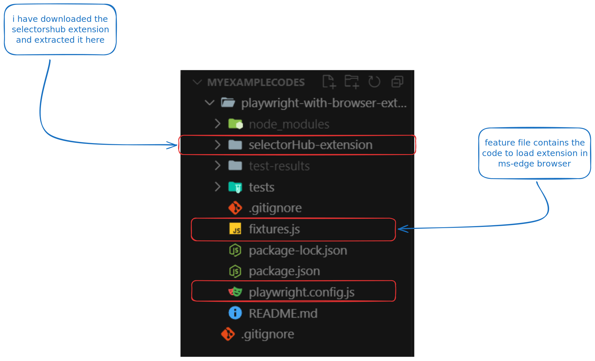
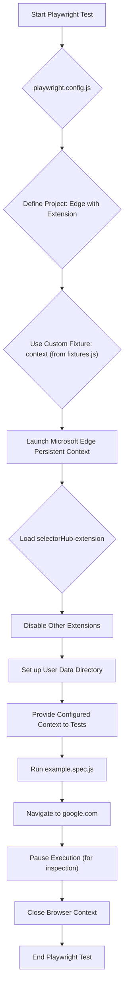

# Playwright with Browser Extension Example

<div align="center">
    
</div>

This project demonstrates how to run Playwright tests with a custom browser extension loaded into Microsoft Edge. It utilizes custom fixtures to set up a persistent browser context with the extension enabled.

## Project Structure

- `playwright.config.js`: Playwright configuration, specifying the test directory and project settings for Edge with Extension.
- `fixtures.js`: Contains custom Playwright fixtures responsible for launching Microsoft Edge, loading the `selectorHub-extension`, and managing a persistent user data directory.
- `tests/`: Directory for Playwright test files. `example.spec.js` is an example test demonstrating basic navigation.
- `selectorHub-extension/`: The directory containing the browser extension to be loaded.
- `user-data/`: A directory created by Playwright for persistent user data, managed by the custom fixture.

## Setup

1.  **Install Node.js and npm** (if you haven't already).

2.  **Navigate to the project directory**:

    ```bash
    cd playwright-with-browser-extension
    ```

3.  **Install dependencies**:

    ```bash
    npm install
    ```

## How to Run Tests

To run the tests, use the Playwright test runner:

```bash
npx playwright test
```

This will launch Microsoft Edge with the `selectorHub-extension` loaded and execute the tests defined in the `tests/` directory.

## Custom Fixture (`fixtures.js`)

The `fixtures.js` file extends the default Playwright `test` object to provide a custom `context` fixture. This fixture performs the following key actions:

- Launches Microsoft Edge using `chromium.launchPersistentContext` with the `channel: 'msedge'` option.
- Disables all other extensions and loads the `selectorHub-extension` using `args: [`--disable-extensions-except=${pathToExtension}`, `--load-extension=${pathToExtension}`]`.
- Uses a `user-data` directory to maintain persistent user data across test runs. 


## Mermaid Diagram:

